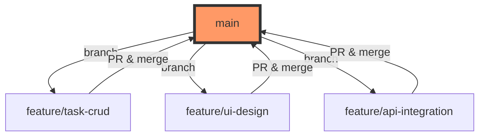
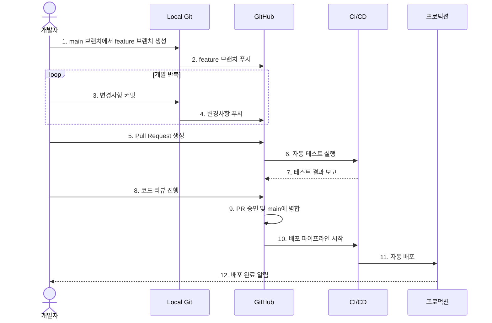

# 🗒️ TODO 애플리케이션

간단하고 효율적인 할 일 관리 웹 애플리케이션입니다. React로 구현된 프론트엔드와 AWS 서버리스 아키텍처로 구현된 백엔드를 통해 사용자들이 손쉽게 할 일을 관리할 수 있습니다.

## ✨ 주요 기능

- 할 일 생성, 수정, 삭제
- 로그인 없이 즉시 사용 가능
- 모바일/데스크톱 반응형 디자인
- 실시간 데이터 동기화

## 🛠️ 기술 스택

### 프론트엔드
- React
- GitHub Pages (호스팅)

### 백엔드
- AWS CDK (Infrastructure as Code)
- AWS Lambda (서버리스 함수)
- Amazon DynamoDB (데이터베이스)
- Amazon API Gateway (API 엔드포인트)
- AWS Cognito (인증 관리)

## 🚀 시작하기

### 프론트엔드 실행하기

```bash
# 저장소 클론
git clone <repository-url>

# 프로젝트 디렉토리로 이동
cd todo-app

# 의존성 설치
npm install

# 개발 서버 실행
npm start
```

### 백엔드 배포하기

```bash
# AWS CDK CLI 설치
npm install -g aws-cdk

# CDK 프로젝트 디렉토리로 이동
cd infrastructure

# 의존성 설치
npm install

# AWS 계정에 CDK 배포
cdk deploy
```

## 📁 프로젝트 구조

```
.
├── frontend/          # React 프론트엔드 코드
├── infrastructure/    # AWS CDK 인프라 코드
└── doc/              # 프로젝트 문서
    ├── design.md     # 설계 문서
    └── todo.md       # 개발 체크리스트
```

## 🔗 API 엔드포인트

- `GET /tasks` - 할 일 목록 조회
- `POST /tasks` - 새로운 할 일 생성
- `PUT /tasks/{id}` - 할 일 수정
- `DELETE /tasks/{id}` - 할 일 삭제

## 🌳 브랜치 관리 전략

프로젝트는 GitHub Flow 전략을 따릅니다. 이는 단순하고 효율적인 방식으로, 지속적 배포와 협업을 촉진합니다.

### 브랜치 구조

- `main`: 프로덕션 브랜치, 항상 배포 가능한 상태 유지
- `feature/*`: 모든 개발 작업은 feature 브랜치에서 진행 (예: `feature/add-task-filtering`)



### 작업 흐름

#### 개발 프로세스 시퀀스 다이어그램



### 상세 작업 단계

1. 새로운 기능 개발 시작:
   ```bash
   git checkout main
   git pull origin main
   git checkout -b feature/기능이름
   ```

2. 작업 중 주기적인 커밋:
   ```bash
   git add .
   git commit -m "하나의 변경사항에 대한 명확한 메시지"
   git push origin feature/기능이름
   ```

3. Pull Request 생성:
   - GitHub에서 PR 생성
   - 코드 리뷰 진행
   - 자동화된 테스트 통과 확인
   - PR 승인 및 병합

4. 배포:
   - main 브랜치에 병합되면 자동으로 배포 진행
   - 배포 후 모니터링

## 👥 기여하기

1. 이 저장소를 포크합니다
2. 개발 브랜치에서 새로운 feature 브랜치를 생성합니다
3. 변경사항을 커밋합니다
4. 브랜치에 푸시합니다
5. develop 브랜치로 Pull Request를 생성합니다

## 📝 라이선스

이 프로젝트는 MIT 라이선스를 따릅니다. 자세한 내용은 [LICENSE](LICENSE) 파일을 참조하세요.

## 🤝 지원 및 피드백

문제가 발생하거나 제안사항이 있으시다면 이슈를 생성해 주세요. 모든 피드백은 환영합니다!
